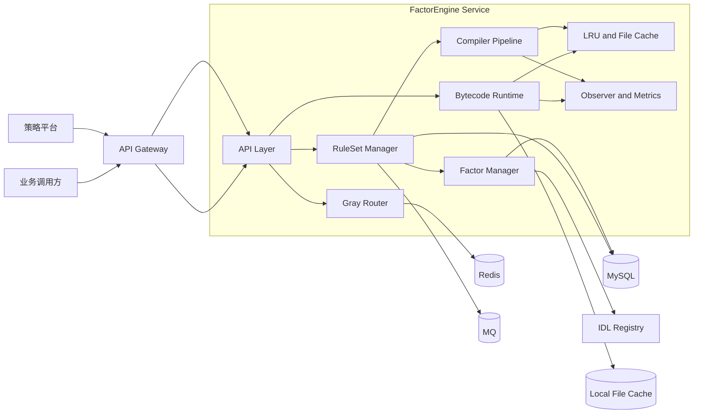
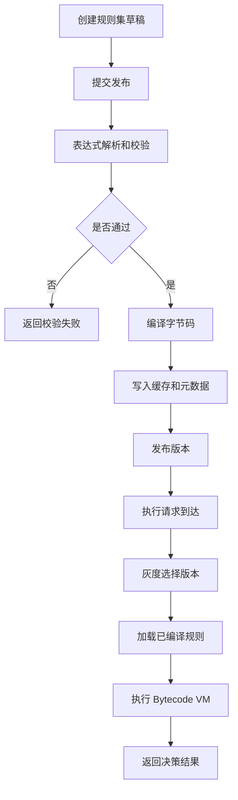
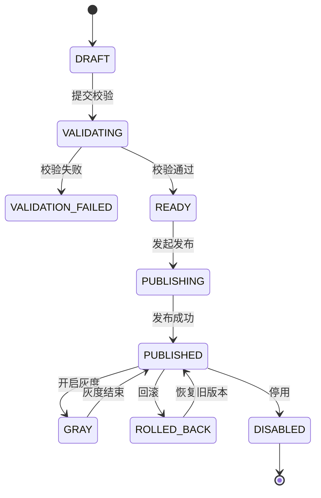
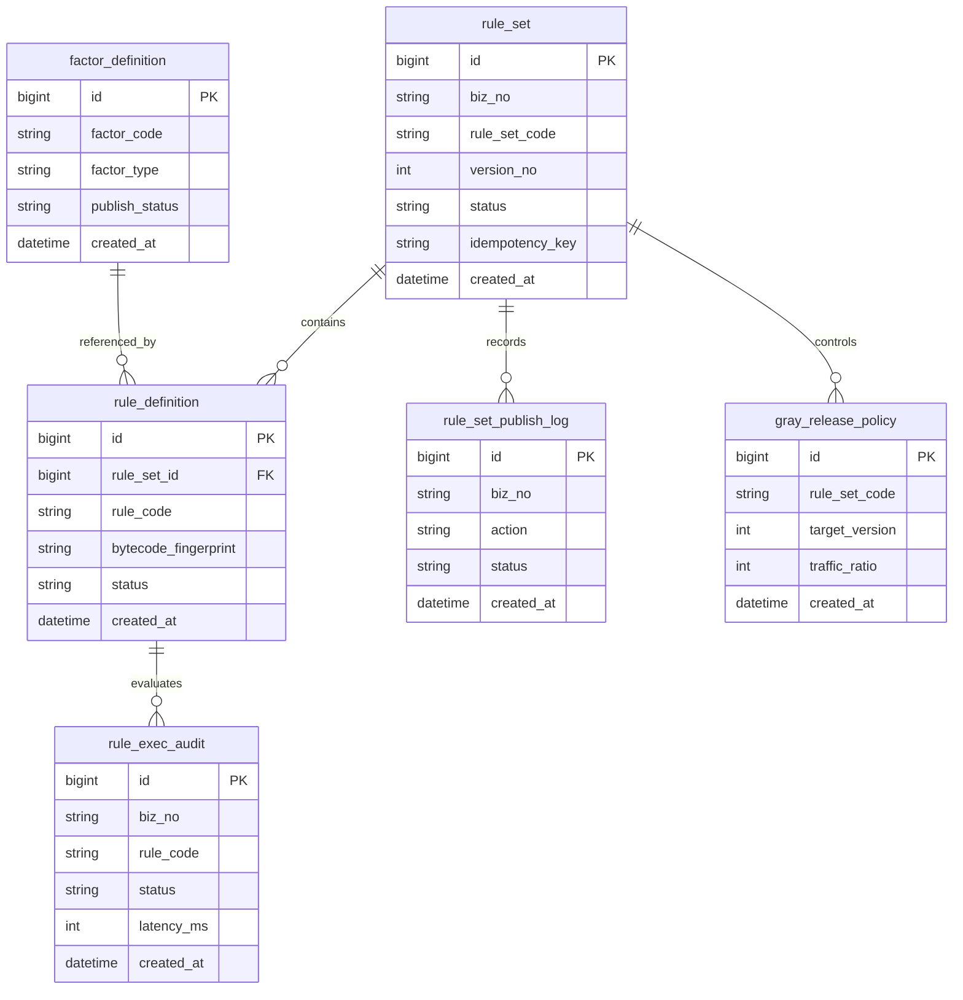
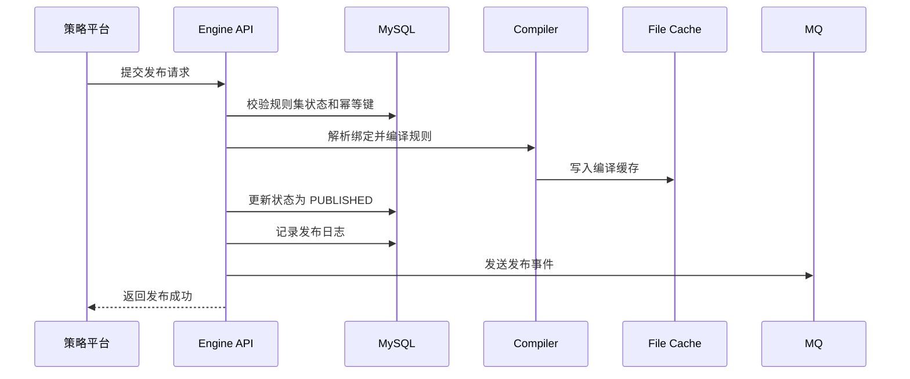
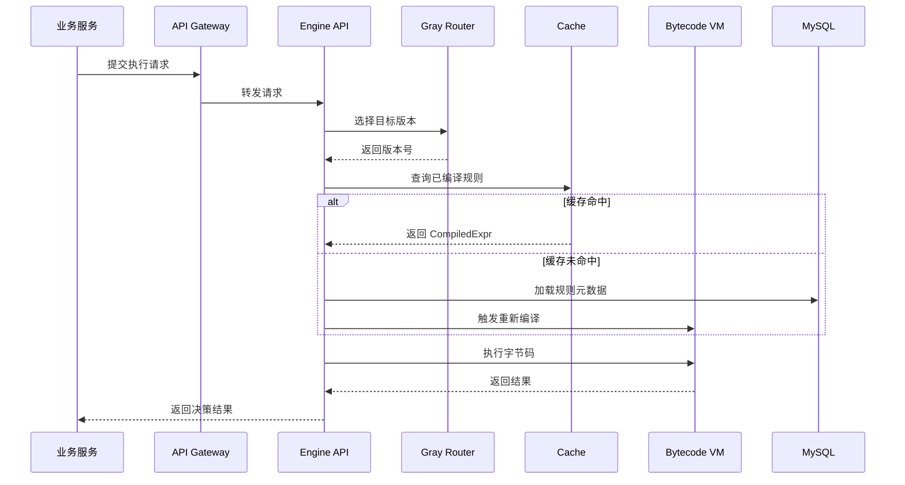
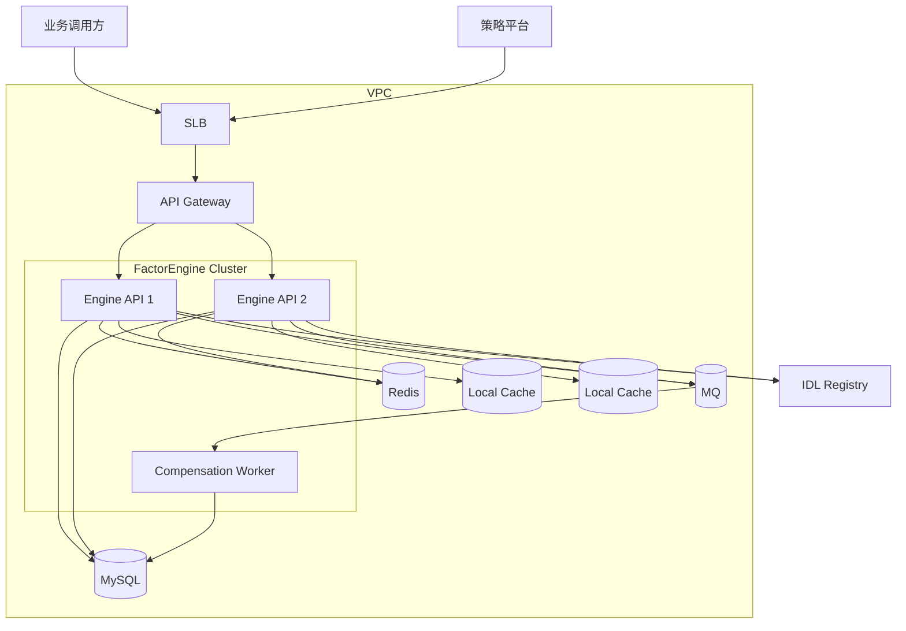

# 技术方案：FactorEngine 规则因子表达式引擎服务化设计

## 1. 背景与目标

### 1.1 背景

当前项目 `factorengine` 已实现规则表达式引擎内核，核心能力包括：

- 因子定义与 Schema 校验
- 表达式解析、绑定、类型检查
- BoundExpr 到 BytecodeProgram 的编译
- 基于字节码虚拟机的执行
- 编译缓存、本地持久化缓存、观测统计
- RuleSet 发布与版本管理

从代码结构看，当前项目更偏向可嵌入式库，尚未形成完整的服务化方案、持久化元数据管理方案和对外接口规范。为了支撑风控、准入、营销、人群分层等场景，需要基于现有内核补齐服务化设计，形成可评审、可实施、可上线的技术方案。

### 1.2 当前问题

- 当前能力主要驻留在进程内，缺少统一 API 和多实例部署方案。
- `EngineService` 仅提供内存态规则集发布与加载，重启后状态丢失。
- 编译缓存虽支持文件持久化，但缺少规则元数据、发布记录、审计日志等持久化设计。
- 观测能力已有接口，但未沉淀为统一指标、日志、告警与排障入口。
- 规则发布、灰度、生效、回滚、失效等生命周期缺少状态机和操作约束。
- 因子注册、IDL 版本管理、规则集版本管理缺少平台化治理设计。

### 1.3 建设目标

- 在保留当前字节码执行内核的前提下，构建 `FactorEngine Service`。
- 统一管理因子定义、规则集定义、版本发布、编译缓存和执行观测。
- 提供同步试运行、正式执行、规则集发布、回滚、灰度切换能力。
- 支持多实例部署、缓存复用、可观测、可回滚和可灰度上线。
- 为后续 RPC 因子执行器、异步因子预取、规则链路追踪留下扩展位。

### 1.4 非目标

- 不在本期实现完整因子采集平台。
- 不在本期实现可视化规则编排前端。
- 不在本期引入分布式工作流引擎。
- 不在本期实现跨机房强一致规则发布。

---

## 2. 需求理解

### 2.1 核心业务流程

调用方提交执行请求，服务加载指定规则集版本，按表达式依赖读取上下文因子，执行字节码 VM，返回命中结果与执行明细。运营或策略平台可发布新规则集版本，并按灰度策略切换流量。

### 2.2 核心角色

- 策略运营：维护规则内容，发起发布、回滚、灰度。
- 业务服务：通过 API 调用规则引擎获取决策结果。
- 因子平台：提供已发布因子定义和上下游 RPC/数据源约束。
- 运维与 SRE：负责部署、监控、告警和容量治理。

### 2.3 核心业务对象

- 因子定义 `FactorDefinition`
- 规则定义 `RuleDefinition`
- 规则集 `RuleSetDefinition`
- 已发布规则集 `PublishedRuleSet`
- 编译结果 `CompiledExpr`
- 字节码程序 `BytecodeProgram`
- 编译缓存条目 `PersistedProgramEntry`
- 执行请求 / 执行结果 / 发布记录 / 灰度策略

### 2.4 功能范围

本期方案覆盖：

- 因子定义管理
- 规则集创建、校验、发布、回滚
- 编译缓存和持久化缓存
- 同步执行 API
- 试运行 API
- 规则执行观测
- 灰度发布与回滚

### 2.5 非功能要求

- 单次表达式执行延迟目标：P95 小于 10ms，缓存命中时 P95 小于 3ms
- 服务可用性目标：99.9%
- 规则发布可回滚，回滚生效时间小于 1 分钟
- 所有写接口支持幂等
- 执行链路可观测，支持 Trace、日志和核心指标

### 2.6 关键假设

- 当前 `factorengine` 作为核心执行内核继续保留，不推翻字节码模型。
- 执行请求所需因子值默认由调用方直接传入 `EvalContext`，本期不统一做在线因子拉取编排。
- 因子定义、规则集元数据可落 MySQL；编译缓存可使用本地 LRU + 文件缓存。
- 灰度切流由网关或业务侧透传租户、商户、流量标签等维度实现。

### 2.7 待确认问题

- 是否需要在本期支持“规则执行时自动拉取 RPC 因子”。
- 规则执行是否必须返回完整 TraceStep，还是仅调试场景返回。
- 规则结果是否只返回单规则布尔值，还是要支持规则集聚合决策。
- 多版本规则集的流量切换由引擎服务承担，还是由上游策略平台下发版本号。

---

## 3. 系统边界

### 3.1 本系统负责

- 管理因子定义和规则集元数据
- 对规则表达式做解析、绑定、类型检查、字节码编译
- 提供规则发布、加载、执行、灰度、回滚能力
- 管理编译缓存、发布记录、审计记录和观测指标

### 3.2 本系统不负责

- 用户登录认证中心实现
- 上游业务请求鉴权体系
- RPC 因子背后下游服务的数据生产
- 第三方系统内部处理逻辑
- 可视化规则编辑器实现

### 3.3 上游系统

- 策略平台
- 风控决策服务
- 营销 / 准入 / 运营平台
- API Gateway

### 3.4 下游系统

- MySQL 元数据库
- 本地文件系统缓存目录
- Redis 灰度配置与热点路由缓存
- MQ 事件总线
- 可观测平台

### 3.5 外部依赖

- Thrift IDL Registry
- 因子平台 / RPC 服务治理平台
- 配置中心

---

## 4. 总体架构设计

### 4.1 设计原则

- 内核稳定：继续复用当前 Parser、Binder、BytecodeCompiler、BytecodeVM。
- 元数据外置：规则集、因子定义、发布记录由数据库持久化。
- 执行无状态：服务实例本身尽量无状态，依赖外部元数据和本地缓存恢复。
- 缓存分层：请求级热缓存、进程内 LRU、本地文件持久化缓存分层组合。
- 发布可回滚：规则发布与流量切换解耦，保留旧版本可快速恢复。
- 观测先行：编译、缓存、执行全链路埋点。

### 4.2 模块划分

- API 层：接收规则管理与执行请求
- RuleSet 管理模块：规则集创建、校验、发布、回滚
- Factor 管理模块：因子定义、IDL 校验、依赖校验
- Compile 模块：解析、绑定、类型检查、字节码编译
- Runtime 模块：BytecodeVM 执行与 Trace 输出
- Cache 模块：LRU、本地文件持久化缓存
- Governance 模块：灰度配置、审计、观测、告警

### 4.3 核心模块职责

- `parser.go` / `expression_parser.go`：表达式语法解析
- `binder.go`：因子引用解析、类型收敛、BoundExpr 构建
- `bytecode.go`：常量折叠、指令生成、VM 执行、预算控制
- `compiler_cache.go` / `persistent_cache.go`：编译缓存和持久化恢复
- `observer.go`：编译、缓存、执行指标采样
- `engine_service.go`：规则集发布、版本管理、加载与执行
- 新增 `service` 层：HTTP / gRPC API、元数据存储、灰度路由

### 4.4 技术架构图

---

## 5. 业务流程设计

### 5.1 主流程

1. 策略平台创建规则集草稿并提交规则列表。
2. 服务执行表达式解析、类型检查、因子依赖校验。
3. 编译通过后生成字节码与指纹，写入编译缓存。
4. 审核通过后发布规则集版本，并写入发布记录。
5. 执行请求进入时，根据灰度策略选择规则集版本。
6. 服务加载已编译规则并执行 VM，返回结果与观测信息。

### 5.2 异常流程

- 规则表达式非法：发布失败，返回字段级错误。
- 因子未发布或类型不匹配：发布失败，阻断上线。
- 缓存丢失：回源 MySQL 读取元数据并重新编译。
- 执行超预算或上下文取消：快速失败并记录错误码。

### 5.3 业务流程图

---

## 6. 状态机设计

### 6.1 状态定义

以规则集版本为核心业务对象，定义以下状态：

- `DRAFT`：草稿
- `VALIDATING`：校验中
- `VALIDATION_FAILED`：校验失败
- `READY`：校验通过待发布
- `PUBLISHING`：发布中
- `PUBLISHED`：已发布
- `GRAY`：灰度中
- `ROLLED_BACK`：已回滚
- `DISABLED`：已停用

### 6.2 状态流转规则

- 草稿提交后进入 `VALIDATING`
- 校验失败进入 `VALIDATION_FAILED`
- 校验成功进入 `READY`
- 发布时进入 `PUBLISHING`，成功后进入 `PUBLISHED`
- 灰度流量接入时从 `PUBLISHED` 进入 `GRAY`
- 回滚后进入 `ROLLED_BACK`
- 旧版本下线后进入 `DISABLED`

### 6.3 状态机图

---

## 7. 数据架构设计

### 7.1 核心实体

- `factor_definition`
- `factor_idl_binding`
- `rule_set`
- `rule_definition`
- `rule_set_publish_log`
- `gray_release_policy`
- `compile_cache_index`
- `rule_exec_audit`

### 7.2 表结构设计

#### 7.2.1 factor_definition

用于管理因子元数据与 Schema。

| 字段 | 类型 | 说明 |
| --- | --- | --- |
| id | bigint PK | 主键 |
| factor_code | varchar(128) UK | 因子编码 |
| factor_category | varchar(32) | 因子类别 |
| factor_type | varchar(64) | 因子类型 |
| input_schema_json | json | 输入 Schema |
| output_schema_json | json | 输出 Schema |
| dependencies_json | json | 依赖因子 |
| config_json | json | RPC / IDL 配置 |
| publish_status | varchar(32) | 发布状态 |
| version | bigint | 乐观锁版本 |
| created_at | datetime | 创建时间 |
| updated_at | datetime | 更新时间 |
| deleted_at | datetime | 软删除时间 |

索引设计：

- `uk_factor_code`
- `idx_publish_status_updated_at`

#### 7.2.2 rule_set

用于管理规则集版本。

| 字段 | 类型 | 说明 |
| --- | --- | --- |
| id | bigint PK | 主键 |
| biz_no | varchar(64) UK | 规则集业务号 |
| rule_set_code | varchar(128) | 规则集编码 |
| version_no | int | 版本号 |
| status | varchar(32) | 状态 |
| idempotency_key | varchar(128) | 幂等键 |
| description | varchar(512) | 说明 |
| fingerprint | varchar(128) | 规则集指纹 |
| created_by | varchar(64) | 创建人 |
| updated_by | varchar(64) | 更新人 |
| created_at | datetime | 创建时间 |
| updated_at | datetime | 更新时间 |
| deleted_at | datetime | 软删除时间 |
| version | bigint | 乐观锁版本 |
| remark | varchar(512) | 备注 |

唯一约束：

- `uk_rule_set_code_version`
- `uk_rule_set_biz_no`
- `uk_rule_set_idempotency_key`

#### 7.2.3 rule_definition

用于存储单条规则和编译产物索引。

| 字段 | 类型 | 说明 |
| --- | --- | --- |
| id | bigint PK | 主键 |
| rule_set_id | bigint FK | 所属规则集 |
| rule_code | varchar(128) | 规则编码 |
| expression_text | text | 规则表达式 |
| result_type | varchar(32) | 结果类型 |
| bytecode_fingerprint | varchar(128) | 字节码指纹 |
| compile_cache_key | varchar(256) | 缓存键 |
| status | varchar(32) | 状态 |
| created_at | datetime | 创建时间 |
| updated_at | datetime | 更新时间 |

唯一约束：

- `uk_rule_set_rule_code`

#### 7.2.4 rule_set_publish_log

用于记录发布、回滚、灰度操作。

| 字段 | 类型 | 说明 |
| --- | --- | --- |
| id | bigint PK | 主键 |
| biz_no | varchar(64) UK | 操作流水号 |
| rule_set_code | varchar(128) | 规则集编码 |
| version_no | int | 版本 |
| action | varchar(32) | PUBLISH / ROLLBACK / DISABLE |
| status | varchar(32) | 处理状态 |
| operator | varchar(64) | 操作人 |
| payload_json | json | 请求快照 |
| result_json | json | 结果快照 |
| created_at | datetime | 创建时间 |
| updated_at | datetime | 更新时间 |

#### 7.2.5 gray_release_policy

用于管理版本灰度。

| 字段 | 类型 | 说明 |
| --- | --- | --- |
| id | bigint PK | 主键 |
| rule_set_code | varchar(128) | 规则集编码 |
| target_version | int | 目标版本 |
| status | varchar(32) | 状态 |
| dimension_type | varchar(32) | 维度类型 |
| dimension_value | varchar(256) | 维度值 |
| traffic_ratio | int | 百分比 |
| created_at | datetime | 创建时间 |
| updated_at | datetime | 更新时间 |

#### 7.2.6 rule_exec_audit

用于保留抽样执行审计。

| 字段 | 类型 | 说明 |
| --- | --- | --- |
| id | bigint PK | 主键 |
| biz_no | varchar(64) UK | 请求流水号 |
| rule_set_code | varchar(128) | 规则集编码 |
| version_no | int | 版本 |
| rule_code | varchar(128) | 规则编码 |
| request_json | json | 入参快照 |
| result_json | json | 出参快照 |
| status | varchar(32) | 成功或失败 |
| error_code | varchar(64) | 错误码 |
| latency_ms | int | 耗时 |
| trace_id | varchar(128) | 链路标识 |
| created_at | datetime | 创建时间 |

### 7.3 数据生命周期

- 因子定义和规则集元数据长期保留
- 发布日志保留 180 天
- 执行审计默认抽样保留 30 天
- 编译缓存索引保留 7 天，可按访问热度续期

### 7.4 ER 图

---

## 8. 接口设计

### 8.1 API 列表

- `POST /api/factors/create`
- `POST /api/factors/publish`
- `POST /api/rule-sets/create`
- `POST /api/rule-sets/publish`
- `POST /api/rule-sets/rollback`
- `GET /api/rule-sets/detail`
- `POST /api/rule-sets/evaluate`
- `POST /api/rule-sets/dry-run`
- `POST /api/rule-sets/gray`

### 8.2 接口职责

- 因子接口：管理因子定义和发布
- 规则集接口：管理草稿、版本、发布、回滚和灰度
- 执行接口：同步执行指定规则集
- 试运行接口：返回详细 Trace 与调试信息

### 8.3 关键接口说明

#### 8.3.1 创建规则集

`POST /api/rule-sets/create`

请求字段：

- `idempotency_key`
- `rule_set_code`
- `version_no`
- `description`
- `rules`

响应字段：

- `rule_set_id`
- `rule_set_code`
- `version_no`
- `status`

错误码：

- `DEFINITION_INVALID`
- `UNKNOWN_IDENTIFIER`
- `TYPE_MISMATCH`
- `IDEMPOTENT_CONFLICT`

幂等策略：

- `idempotency_key` 由调用方生成
- 以 `rule_set_code + version_no + idempotency_key` 做唯一约束
- 重复提交直接返回首次结果

#### 8.3.2 发布规则集

`POST /api/rule-sets/publish`

请求字段：

- `idempotency_key`
- `rule_set_code`
- `version_no`
- `operator`

处理逻辑：

- 校验状态必须为 `READY`
- 编译全部规则并写入缓存
- 更新规则集状态到 `PUBLISHED`
- 记录发布日志并发送变更事件

#### 8.3.3 回滚规则集

`POST /api/rule-sets/rollback`

请求字段：

- `idempotency_key`
- `rule_set_code`
- `target_version`
- `operator`

回滚策略：

- 仅切换流量版本，不删除已发布元数据
- 若目标版本缓存缺失，先回源重编译再切流

#### 8.3.4 执行规则集

`POST /api/rule-sets/evaluate`

请求字段：

- `request_id`
- `rule_set_code`
- `version_no`，可选
- `route_tags`
- `context`
- `rules`，可选

响应字段：

- `request_id`
- `rule_set_code`
- `version_no`
- `results`
- `latency_ms`
- `trace_id`

鉴权要求：

- 仅允许服务间鉴权调用
- 控制台接口需具备发布与回滚权限

### 8.4 并发与重试

- 写接口全部要求 `idempotency_key`
- 发布和回滚操作使用数据库唯一索引 + 状态机校验防重
- 并发发布同一版本时，后到请求返回“处理中”或首次结果
- 执行接口可重试，但要求 `request_id` 用于审计去重

---

## 9. 时序设计

### 9.1 发布时序图

### 9.2 执行时序图

---

## 10. 异常处理与补偿

| 场景 | 失败点 | 影响范围 | 自动重试 | 补偿方案 | 告警 |
| --- | --- | --- | --- | --- | --- |
| 参数错误 | API 校验失败 | 单请求 | 否 | 直接返回错误 | 否 |
| 重复请求 | 幂等键冲突 | 单请求 | 否 | 返回首次结果 | 否 |
| 并发发布 | 状态竞争 | 单规则集版本 | 否 | 状态机 + 乐观锁拒绝重复推进 | 是 |
| 数据库写入失败 | 元数据持久化失败 | 发布链路 | 是，有限重试 | 写发布失败日志，状态回滚到 READY | 是 |
| 文件缓存写失败 | 持久化缓存失败 | 单实例缓存预热 | 否 | 退化为内存缓存 + 回源编译 | 否 |
| MQ 发送失败 | 发布事件未发出 | 配置同步链路 | 是 | Outbox 补发任务 | 是 |
| 执行超时 | VM 超预算或 Context Cancel | 单请求 | 否 | 返回错误码，记录审计 | 是 |
| 下游 IDL 不一致 | 发布校验 | 单因子或规则集 | 否 | 阻断发布，要求修复配置 | 是 |
| 多次重编译失败 | 缓存恢复失败 | 单规则集版本 | 是，有限重试 | 标记版本异常并熔断灰度 | 是 |
| 状态不一致 | DB 成功但 MQ 丢失 | 发布后链路 | 是 | Outbox 补偿 + 巡检任务修复 | 是 |
| 部分成功 | 部分规则编译失败 | 单版本 | 否 | 整体发布失败，不允许部分发布 | 是 |

人工介入场景：

- 同一规则集长期处于 `PUBLISHING`
- 灰度版本命中错误率升高
- 规则元数据和缓存指纹不一致

---

## 11. 幂等设计

### 11.1 需要幂等的对象

- 创建因子
- 发布因子
- 创建规则集
- 发布规则集
- 回滚规则集
- 灰度配置变更
- 发布事件消费任务

### 11.2 幂等策略

- 写接口：`业务唯一键 + idempotency_key + 数据库唯一索引`
- 发布推进：`状态机判断 + 乐观锁 version`
- 事件消费：`biz_no` 或消息 `message_id` 去重表
- 巡检补偿：按 `rule_set_code + version_no + action` 防重复执行

### 11.3 并发防重

- 不仅依赖 Redis 锁
- 以数据库唯一约束作为最终幂等保障
- Redis 仅用于热点限流和短期互斥

---

## 12. 数据一致性设计

### 12.1 强一致场景

- 规则集状态变更
- 规则定义与所属规则集版本关系
- 发布日志写入

以上采用本地事务保证一致性。

### 12.2 最终一致场景

- 发布事件通知
- 缓存预热
- 灰度配置下发
- 观测数据汇聚

以上采用 Outbox Pattern + 异步消费保证最终一致。

### 12.3 不一致发现与修复

- 巡检任务定时核对 `rule_set.status` 与发布日志状态
- 比对 DB 中 `bytecode_fingerprint` 与缓存恢复指纹
- 对灰度版本命中率与目标策略做一致性扫描
- 发现异常后写告警并触发修复任务

---

## 13. 安全与权限设计

- 控制台管理接口要求用户鉴权、角色鉴权和操作审计
- 执行接口仅允许服务间访问，采用网关签名或 mTLS
- 规则表达式禁止任意代码执行，仅允许白名单运算符和内建函数
- 试运行接口限制调用频率，避免大对象 Trace 放大资源占用
- 审计日志脱敏保存上下文中的敏感字段

---

## 14. 部署架构

### 14.1 部署说明

- API 服务多实例无状态部署
- 实例本地磁盘保存文件缓存
- MySQL 主从或高可用集群存储元数据
- Redis 保存灰度路由和热点元数据
- MQ 投递发布与巡检事件
- 定时任务实例执行补偿和巡检

### 14.2 部署架构图

### 14.3 高可用与扩容

- API 层水平扩容
- 灰度路由信息放 Redis，避免实例本地不一致
- 本地文件缓存作为性能优化，不作为唯一数据源
- Worker 至少双实例部署，消费组模式防单点

---

## 15. 监控与告警

### 15.1 日志

- 发布操作日志
- 编译失败日志
- 执行失败日志
- 缓存恢复失败日志
- 巡检与补偿日志

### 15.2 指标

- `compile_requests_total`
- `compile_failures_total`
- `compile_duration_ms`
- `eval_requests_total`
- `eval_failures_total`
- `eval_duration_ms`
- `cache_hit_ratio`
- `cache_restore_failures_total`
- `gray_route_mismatch_total`
- `publish_failures_total`

### 15.3 链路追踪

- 执行接口透传 `trace_id`
- 发布接口生成 `operation_id`
- 关键阶段打点：校验、编译、缓存、执行、回滚

### 15.4 告警项

- 核心执行接口失败率突增
- 执行 P95 / P99 显著升高
- 编译缓存命中率持续下降
- 灰度版本错误率高于基线
- 发布任务卡在 `PUBLISHING`
- 巡检补偿任务连续失败

---

## 16. 灰度与回滚方案

### 16.1 灰度方案

- 支持按租户 ID、商户 ID、渠道、地区、流量比例灰度
- 灰度规则存储在 `gray_release_policy`
- 网关或服务侧透传路由标签，服务选择命中版本

### 16.2 发布步骤

1. 创建新规则集版本
2. 完成校验并编译缓存预热
3. 发布到 `PUBLISHED`
4. 对指定维度开启小流量灰度
5. 观察关键指标
6. 扩大灰度直至全量

### 16.3 回滚步骤

1. 停止新版本灰度
2. 将路由切回旧版本
3. 校验旧版本缓存可用
4. 标记新版本为 `ROLLED_BACK`
5. 输出回滚审计记录

### 16.4 数据回滚策略

- 规则元数据不做物理删除
- 回滚以“流量切换”为主，不做历史数据反写
- 若灰度策略异常，直接清理灰度配置恢复全量旧版本

---

## 17. 风险与取舍

| 风险 | 影响范围 | 等级 | 应对方案 | 取舍 |
| --- | --- | --- | --- | --- |
| 字节码执行语义与解释执行不一致 | 规则结果错误 | 高 | 保留双路径回归测试，新增差异测试集 | 继续采用字节码以换取性能 |
| 本地文件缓存跨实例不共享 | 冷启动抖动 | 中 | 允许回源重编译，后续可演进对象存储或共享缓存 | 当前先保留简单实现 |
| 规则元数据持久化新增复杂度 | 发布链路增加 | 中 | 拆清元数据与执行内核边界 | 用工程治理换稳定性 |
| Trace 输出过大 | 接口延迟和内存放大 | 中 | 仅试运行和抽样审计开启 | 不默认全量返回 Trace |
| 灰度策略错误导致错流量 | 线上命中异常 | 高 | 配置校验、双人复核、实时监控 | 支持快速回滚 |
| 因子 Schema 演进不兼容 | 发布阻断或执行失败 | 高 | 引入版本化校验和兼容性检查 | 优先保证正确性 |

---

## 18. 实施计划

### 18.1 阶段一：方案评审

- 任务内容：确认规则集生命周期、接口边界、灰度策略
- 负责人角色：架构师、后端负责人、策略平台负责人
- 产出物：技术方案评审纪要
- 验收标准：核心边界和目标态达成一致

### 18.2 阶段二：元数据与接口设计

- 任务内容：落表、定义 API、补充错误码和鉴权模型
- 负责人角色：后端开发
- 产出物：DDL、API 文档
- 验收标准：接口评审通过

### 18.3 阶段三：核心功能开发

- 任务内容：实现规则集持久化、发布、回滚、灰度和执行 API
- 负责人角色：后端开发
- 产出物：服务代码、单元测试
- 验收标准：核心接口可联调

### 18.4 阶段四：联调

- 任务内容：对接策略平台、网关、监控平台
- 负责人角色：后端开发、调用方
- 产出物：联调记录
- 验收标准：主流程全部跑通

### 18.5 阶段五：测试

- 任务内容：功能、性能、回滚、灰度、异常补偿测试
- 负责人角色：测试、后端开发
- 产出物：测试报告
- 验收标准：阻断级缺陷清零

### 18.6 阶段六：灰度上线

- 任务内容：小流量上线与观测
- 负责人角色：SRE、后端开发
- 产出物：灰度观察记录
- 验收标准：核心指标稳定

### 18.7 阶段七：全量发布

- 任务内容：扩大流量并完成全量切换
- 负责人角色：SRE、业务负责人
- 产出物：发布记录
- 验收标准：旧版本可下线

### 18.8 阶段八：观察与复盘

- 任务内容：复盘性能、稳定性和规则治理问题
- 负责人角色：架构师、后端负责人
- 产出物：复盘文档
- 验收标准：形成后续迭代项

---

## 19. 验收标准

- 可通过 API 完成因子定义、规则集创建、发布、回滚、执行
- 规则表达式发布前可完成类型校验和依赖校验
- 执行链路支持缓存命中与缓存失效回源
- 观测指标、日志、告警可覆盖编译和执行主链路
- 灰度发布支持按维度切流并可一键回滚
- 单元测试、集成测试和回归测试覆盖核心流程

---

## 20. 架构评审清单

- 规则执行请求是否必须由调用方传全量因子上下文
- 是否要在本期支持规则集聚合决策，而不只是单规则执行
- 规则集版本切换权责是否在引擎服务内部
- 本地文件缓存是否满足生产容灾要求
- 审计数据抽样比例和脱敏规则是否满足合规要求
- 灰度路由维度是否需要动态扩展
- 规则回滚是否需要与调用方版本锁定机制联动
